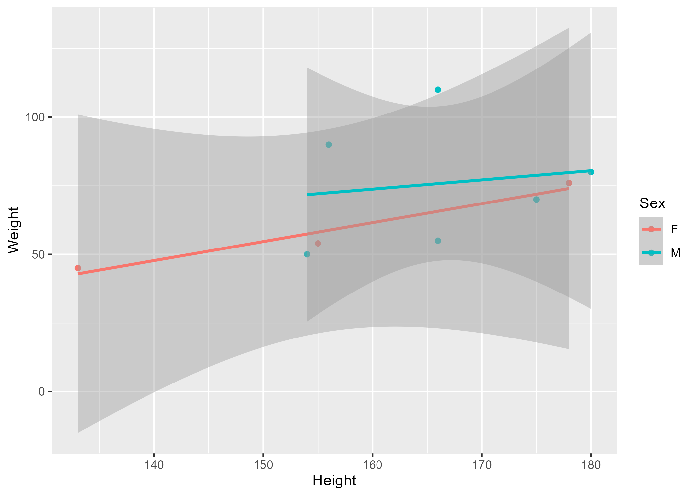

The structure below is a possible setup for a data analysis project (including the course project). For a manuscript, adjust as needed. 
You don't need to have exactly these sections, but the content covering those sections should be addressed.


# Summary/Abstract
_Write a summary of your project._


# Introduction 

## General Background Information
_Provide enough background on your topic that others can understand the why and how of your analysis_ 

## Description of data and data source
_Describe what the data is, what it contains, where it is from, etc. Eventually this might be part of a methods section._

## Questions/Hypotheses to be addressed
_State the research questions you plan to answer with this analysis._


# Methods 

_Describe your methods. That should describe the data, the cleaning processes, and the analysis approaches. You might want to provide a shorter description here and all the details in the supplement._


## Data aquisition
_As applicable, explain where and how you got the data. If you directly import the data from an online source, you can combine this section with the next._


## Data import and cleaning
_Write code that reads in the file and cleans it so it's ready for analysis. Since this will be fairly long code for most datasets, it might be a good idea to have it in one or several R scripts. If that is the case, explain here briefly what kind of cleaning/processing you do, and provide more details and well documented code somewhere (e.g. as supplement in a paper). All materials, including files that contain code, should be commented well so everyone can follow along._


## Statistical analysis
_Explain anything related to your statistical analyses._


# Results

## Exploratory/Descriptive analysis

_Use a combination of text/tables/figures to explore and describe your data. Show the most important descriptive results here. Additional ones should go in the supplement. Even more can be in the R/RmD scripts._


Table \@ref(tab:summarytable) shows a table summarizing the data.


```{r summarytable,  echo=FALSE}
resulttable=readRDS("../../results/summarytable.rds")
knitr::kable(resulttable, caption = 'Data summary table.')
```


## Basic statistical analysis

_To get some further insight into your data, if reasonable you could compute simple statistics (e.g. simple models with 1 predictor) to look for associations between your outcome(s) and each individual predictor variable. Though note that unless you pre-specified the outcome and main exposure, any "p<0.05 means statistical significance" interpretation is not valid._


Figure \@ref(fig:resultfigure) shows a scatterplot figure produced by one of the R scripts.

```{r resultfigure,  fig.cap='Analysis figure.', echo=FALSE}

```


## Full analysis

_Use one or several suitable statistical/machine learning methods to analyze your data and to produce meaningful figures, tables, etc. This might again be code that is best placed in one or several separate R scripts that need to be well documented. You want the code to produce figures and data ready for display as tables, and save those. Then you load them here._

Example table \@ref(tab:resulttable2) shows a table summarizing a linear model fit.

```{r resulttable,  echo=FALSE}
resulttable=readRDS("../../results/resulttable2.rds")
knitr::kable(resulttable, caption = 'Linear model fit table.')
```


# Discussion

## Summary and Interpretation
_Summarize what you did, what you found and what it means._

## Strengths and Limitations
_Discuss what you perceive as strengths and limitations of your analysis._

## Conclusions
_What are the main take-home messages?_

_Include citations in your Rmd file using bibtex, the list of references will automatically be placed at the end_

This paper [@leek2015] discusses types of analyses. 

These papers [@mckay2020; @mckay2020a] are good examples of papers published using a fully reproducible setup similar to the one shown in this template. 

Note that this cited reference will show up at the end of the document, the reference formatting is determined by the CSL file specified in the YAML header. Many more style files for almost any journal [are available](https://www.zotero.org/styles). You also specify the location of your bibtex reference file in the YAML. You can call your reference file anything you like, I just used the generic word `references.bib` but giving it a more descriptive name is probably better.


# References


