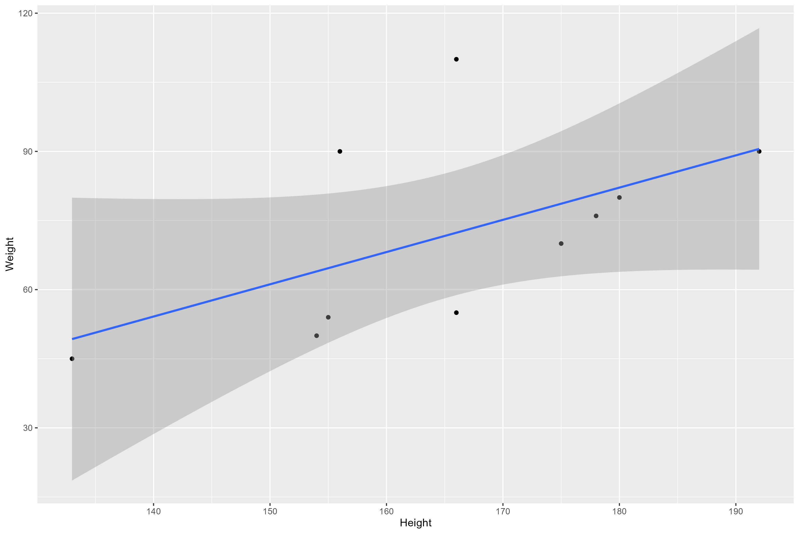

## Example slide 

This shows the summary table

```{r summarytable,  fig.cap='Summary table.', echo=FALSE, fig.align='center', out.width = "60%"}
resulttable=readRDS("../../results/summarytable.rds")
knitr::kable(resulttable)
```

## Example slide 

This shows the figure created by the analysis script.

```{r analysisfig, out.width = "80%",  fig.cap='Scatterplot.', echo=FALSE, fig.align='center'}

```

## Example slide 

This shows the model fitting results as table

```{r analysistable,  fig.cap='Linear model fit results.', echo=FALSE, fig.align='center'}
resulttable=readRDS("../../results/resulttable.rds")
knitr::kable(resulttable)
```

## Example slide 

This paper [@Leek2015a] discusses types of analyses. 

## References


