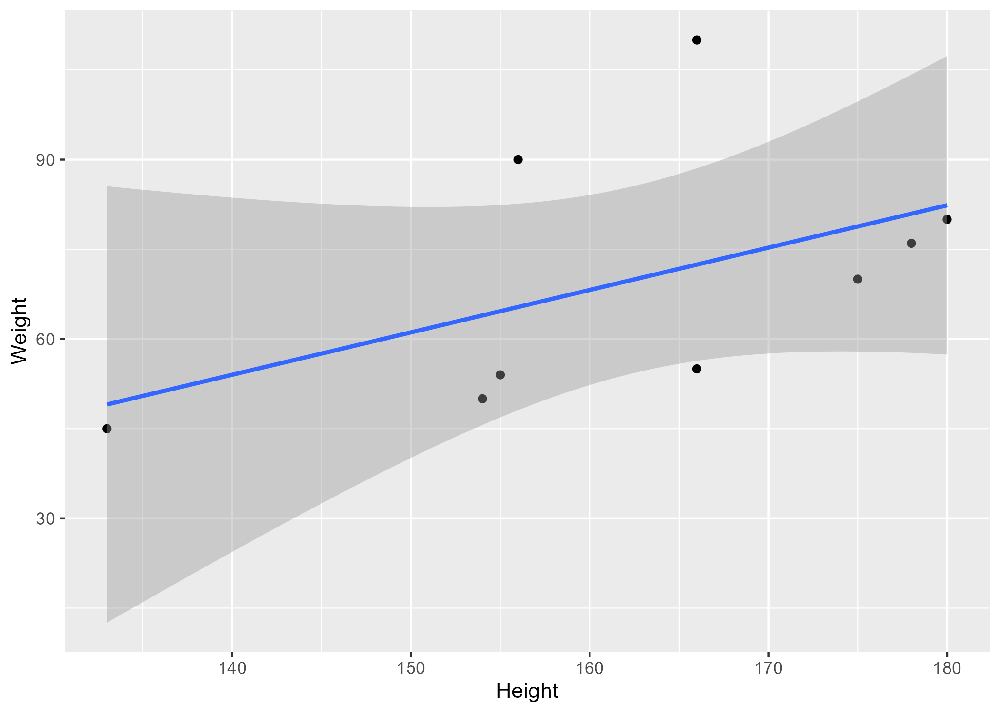

_This just shows some materials that could go into a supplementary file. Often you want/need references here too. You can use the same reference bib file for this and the main text (as done here) or have separate bib files._


# Overview

A quick overview of what readers can find in the supplement.


# Code and file information

Explain here what each code/file is and does, and in which order (if any) users need to run thing to reproduce everything.
Essentially, give a full set of instructions to re-generate everything.


# Additional Method Details

Often, the main manuscript only allows for an overview description of the methods. Use the supplement to describe all your methods, models and approaches in a lot of detail. Reference specific parts of your code as needed.

# Additional results

Show additional results here. Those can be some useful exploratory/descriptive figures or tables, or results from additional analyses that didn't make it into the main text.


## Example additional result


Table \@ref(tab:fittable) shows an additional table summarizing a model fit.


```{r fittable,  echo=FALSE}
resulttable=readRDS("../../results/resulttable1.rds")
knitr::kable(resulttable, caption = 'Data summary table.')
```


Figure \@ref(fig:resultfigure) shows a scatterplot figure produced by one of the R scripts.

```{r resultfigure,  fig.cap='Analysis figure.', echo=FALSE}

```


# Discussion

Any additional discussion regarding the supplementary material/findings.

These papers [@mckay2020; @mckay2020a] are good examples of papers published using a fully reproducible setup similar to the one shown in this template. 


# References


